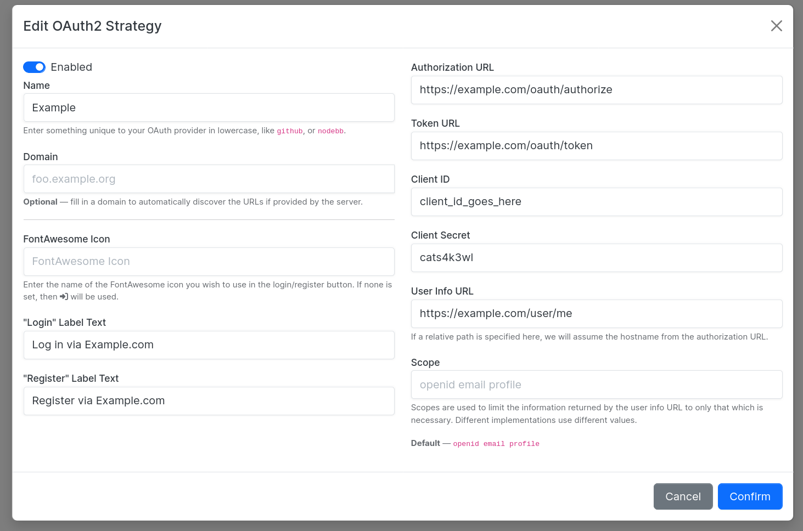

# NodeBB OAuth2 Multiple Client SSO

This NodeBB plugin allows you to configure logins to multiple configurable OAuth2 endpoints, via the admin backend.

## Caveat

Different OAuth2 providers adhere to the standard differently.
This plugin is tested primarily against the following providers:

* [Auth0 by Okta](//auth0.com)
* [Okta](//www.okta.com/)

Support for other OAuth2 providers is _explicitly not guaranteed_.
If you'd like to help this plugin play nice with other providers, please
[open an issue](https://github.com/NodeBB/nodebb-plugin-sso-oauth2-multiple/issues).

## Role-Based Access Control

This plugin is able to sort users into specific user groups based on user roles.
You can maintain a map of roles to user groups, and further limit access via standard category privileges in NodeBB.

_The role-based access control functionality was sponsored by [Outplayed](https://outplayed.com)._

## Screenshots

## For Developers

Other plugins can interact with this plugin, as it fires the following hooks:

1. On successful login — `action:oauth2.login` — passes in `(name, user, profile)`
	* `name` is the strategy name.
	* `user` is the local NodeBB user (probably just the `uid`).
	* `profile` is the remote profile as retrieved by this plugin.